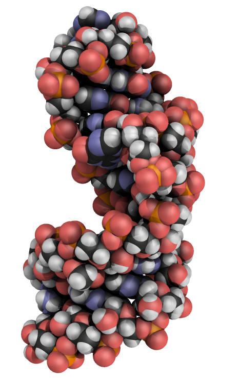

# jupyterlabpymolpysnips: Templates for writing and running PyMOL in Jupyter Notebooks.

[](https://opensource.org/licenses/MIT)
[](https://doi.org/10.5281/zenodo.4429717)


There are many ways to get **PyMOL** running in **JupyterLab**. For details on installing **JupyterLab** and **PyMOL**, go to the [GitHub Page](https://mooerslab.github.io/jupyterlabpymolpysnips/) associated with this project.
For a list of the snippets and their descriptions, also go to the [GitHub Page](https://mooerslab.github.io/jupyterlabpymolpysnips/) associated with this project.

<a id="table-of-contents"><h2>Table of Contents</h2></a>

* [Motivation](#motivation)
* [New to scripting in PyMOL](#new)
* [Tech Stack](#technology-stack)
* [Installation](#installation)
* [Configuration Setup](#configuration-setup)
* [Usage](#usage)
* [Testing](#testing)
* [Requests for new snippets and text editors](#requests)
* [Bug reports](#bugreports)
* [Roadmaps](#roadmap)
* [License](#license)
* [Contact Information](#contact-information)
* [How to cite](#citation)


<a id="motivation"><h2>Motivations for this project</h2></a>

### Use jupyterlabpymolpysnips to be more productive while running PyMOL in Jupyter


<p>The animation below demonstrates the use of the <b>ao.py</b> snippet in <em>JupyterLab</em> to insert 17 lines of code for generating the ambient occlusion effect.</p>

<p align="center"></p>


The result of applying a variant of the above code to a 27-nucleotide RNA hairpin is shown below.

<p align="center"></p>

There is no option in a pulldown menu in **PyMOL** to make such an image. 
A script file with 17 commands is required.
This code can be applied to any molecular object that has been loaded into **PyMOL**.

[Return to Table of Contents](#table-of-contents)


### Why run PyMOL in a Jupyter Notebook?


#### Streamlines the management of images for a project
The images generated by PyMOL can be stored in the one **Jupyter Notebook** file as oppose to having dozens of script and images files squirreled away in dozens of subfolders.
The use of one file greatly eases finding the code to make a particular figure because the code and image can be next to each other. 
This ability to easily find the required code at a later time reduces the resistance to remaking a figure for manuscript resubmission, journal cover artwork, posters, platform presentations, lectures, book chapters, review articles, websites, and wall hangings.

The use of one file also eases the sharing of images with collaborators because only one file needs to be shared.
If the collaborators are not **PyMOL** or **Jupyter Notebook** users, the notebook file can be reformatted as a pdf or HTML file.


#### Facilitates combining PyMOL with other software in molecular structure analysis

Other software can be run from the same notebook during a molecular structure analysis project (e.g, bio3d, ProDy, cctbx, phenix, ccp4, ccpem, xdspy,).
This can improve the reproducibility of the computational aspects of your research.

The primary caveat is that the nonPython software will require different kernels. 
This means that you will have switch kernels to use these packages in the same notebook and that software with different kernels cannot be run in the same cell.
These are very minor limitations.

A secondary caveat is that sadly some heavily used structural biology programs have yet to migrate from Python2 to Python3. 
You may have trouble running a Python2 kernel in **JupyterLab** installed to run with Python3.
No worries, many of these programs can also be run from the terminal.
The input to and output from the terminal can be captured in a **Jupyter Notebook**.
You still carry on with your modern reproducible research practices with legacy code.

[Return to Table of Contents](#table-of-contents)


### But I will miss the interactive viewport in PyMOL!

1. There is nothing stopping you from running the PyMOL GUI next to your **JupyterLab** session. You can adjust the molecule's orientation manual, run the **get_view** command, and copy the output in the command history window from PyMOL and paste it into a cell in the **Jupyter Notebook**. The one line of settings return by the **rv** shortcut are much easier to work with. 
2. You really do not need the viewport. With 10-15 minutes of practice, you can master the rapid iterating of rotate and translate commands to adjust the molecule's orientation with greater precision than via manipulation of the mouse.

[Return to Table of Contents](#table-of-contents)


<a id="new"><h2>New to PyMOL scripting?</h2></a>

If you are not ready to write PyMOL scripts, please consider using [PyMOL shortcuts](https://github.com/MooersLab/pymolshortcuts) to enhance your productivity in **PyMOL** interactive sessions.
For example, the above ambient occlusion effect can be invoked at anytime by entering `AO` at the **PyMOL** prompt, if the *pymolshortcuts.py* file has been loaded.
These shortcuts can also be invoked in a **Jupyter Notebook** by submitting them as arguments to the cmd.do() method, (e.g., cmd.do("AO") to generate the ambient occlusion effect.)## Application Description

The **jupyterlabpymolpysnips** library contains 260 code fragments (i.e, templates or snippets) written in Python to run PyMOL in **JupyterLab** via **PyMOL**'s **Python** API.
This API is only available for recent versions of **PyMOL** that depend on Python3.
This API is available for both the incentive and open-source versions of **PyMOL**.

[Return to Table of Contents](#table-of-contents)


<a id="technology-stack"><h2>Technology Stack</h2></a>

| Technology | Version| Description                 |
|------------|--------------|-----------------------------|
| [PyMOL](https://pymol.org/2/) |   2.4.0    | Molecular graphics program         | 
| Python | 3.7-3.9      |  Programming language          |
| [JupyterLab](https://pypi.org/project/jupyterlab/)  | 2.2.0   | A IDE for editing Jupyter Notebooks. Version 3.0 does not work with jupyterlab-snippets-multimenus|
| [jupyterlab-snippets-multimenus](https://pypi.org/project/jupyterlab-snippets-multimenus/) | 0.1.2 | Required extension |
| Node.js     |  >=10.0.0      | Required by Jupyter and many extensions.   |
| git        | 2.25.1  | Eases the downloading and updating of the libraries. |


Some of the snippets are limited to Python3 code.
If you are using an ancient version of **PyMOL** that relies on Python2, you can buy a license to the current version of **PyMOL**, install a free open-source version of **PyMOL** that depends on Python3 (See the [PyMOL Wiki](https://pymolwiki.org/index.php/Main_Page)), or you can rewrite the snippet's code to be Python2 compliant. 
This often merely involves replacing print statements in Python2 with print() functions in Python3.
The command-line program **2to3** automates this process. 
Note that multiple versions of PyMOL can operate side-by-side on a computer, so you do not have to delete that ancient version of **PyMOL**.

JupyterLab needs to be version 2.2.0 for **jupyterlab-snippets-multimenus** to run. 
The current version of **JupyterLab** is 3.0.

**Node.js** can be downloaded from the developer's site or it can be installed with a package manager.
It needs to be more recent than version 10.0.0 


[Return to Table of Contents](#table-of-contents)

<a id="installation"><h2>Installation of the snippet library</h2></a>

Assuming that **JupyterLab**, **jupyterlab-snippets-multimenus**, and PyMOL are already installed, run the following commands one line at a time,

```bash
jupyter --path
cd ~/.local/share/jupyter # change as per output from prior line. Use cd ~/Library/Jupyter on the Mac.
mkdir multimenus_snippets
cd multimenus_snippets
git clone https://github.com/MooersLab/jupyterlabpymolpysnips.git pymol
git clone https://github.com/MooersLab/jupyterlabpymolpysnipsplus.git pymol+
````

The snippets in the **pymolpysnips+** library have a second copy of the code in a comment with the tab stops marked as follows `${1:default value}`.
Tab stops are sites of parameter values that may need to be edited to customize the snippet.
In most text editors, you hit tab to advance to the next tab stop.
**JupyterLab** does not yet support tab stops.
(If you want to use tab stops in a text editor, visit the [pymolsnips project](https://github.com/MooersLab/pymolsnips)).
Use the **pymol+** library when you need guidance in editing a snippet.
The content of the active part of the snippet is the same in both libraries.
The commented code in the **pymol+** snip library may annoy experienced users who do not need help with editing.


Alternatively, you can download the repository as a zip file by clicking on the green **code** button above.
However, **git** eases the updating of the libraries are a later time.
You would navigate to the `multimenus_snippets/pymol` folder and then enter `git pull` to update the library.
This is far less painful than down downloading the library via as a zip file.
Repeat for `pymol+` if needed.
Navigate back to your home directory before running **JupyterLab** (e.g. `cd` or `cd ~/`).

Now, fire up **JupyterLab**. 

```bash
jupyter lab

````


[Return to Table of Contents](#table-of-contents)


<a id="configuration-setup"><h2>Configuration Setup</h2></a>

The snippet library is independent of PyMOL. 
No modification of PyMOL is required. 

[Return to Table of Contents](#table-of-contents)


<a id="usage"><h2>Usage</h2></a>

The animation at the top of the page conveys the essential knowledge for usage. 

[Return to Table of Contents](#table-of-contents)


<a id="testing"><h2>Testing</h2></a>

Try the **ao.py** snippet. You should get a result similar to the one should in the animation above.

[Return to Table of Contents](#table-of-contents)


<a id="requests"><h2>Requests for new snippets</h2></a>

Please use the **Issues tab** above to request support for additional snippets or to ask questions.
Alternatively, you can send [e-mail](#contact-information) to me.

Questions about PyMOL should be directed to the [PyMOL Mailing List](https://pymolwiki.org/index.php/PyMOL_mailing_list).

[Return to Table of Contents](#table-of-contents)


<a id="requests"><h2>Contributing</h2></a>

Snippets of new code are most welcome. Send to [e-mail](#contact-information).

- Submit the Python code in a plain text file.
- Write the filenames and function names in camelCase.
- Provide a description of what the code does in one to several sentences, an examples of usage, and any citations or links to further information.

[Return to Table of Contents](#table-of-contents)


<a id="bugreports"><h2>Bug reports</h2></a>

Use the **Issues tab** above to report bugs or send [e-mail](#contact-information) to me.

[Return to Table of Contents](#table-of-contents)


<a id="roadmap"><h2>Roadmap</h2></a>

I plan to expand the library to cover with examples the 500 commands and 600 settings in PyMOL.

[Return to Table of Contents](#table-of-contents)


<a id="license"><h2>License</h2></a>

We use the permissive MIT license.
The license information for this project is found in the *License.txt* file above. 

[Return to Table of Contents](#table-of-contents)


<a id="contact-information"><h2>Contact Information</h2></a>

I can be reached via the Issue tab above or via e-mail: `blaine-mooers at ouhsc.edu`.

[Return to Table of Contents](#table-of-contents)


<a id="citation"><h2>Citation</h2></a>

If you use this library to make figures for publication, please see the *Citation.md* file above.

[Return to Table of Contents](#table-of-contents)

